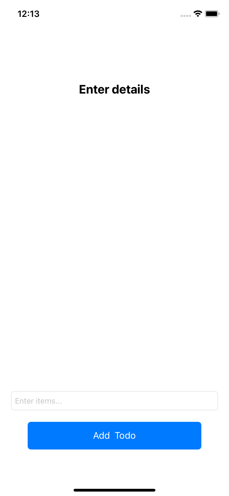
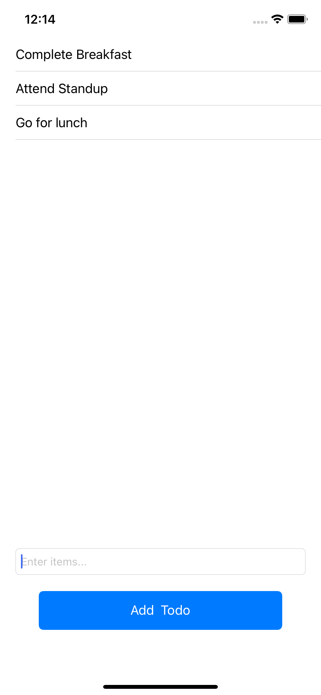
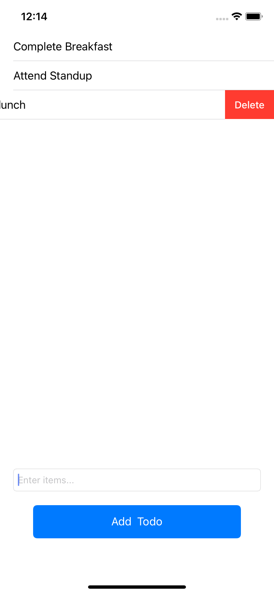

# ToDo

# App Preview

https://user-images.githubusercontent.com/64016523/153771259-e2ba4114-bc9a-471a-afe0-e71277670c24.mp4

# Screenshots

## This is how app looks like initially...

## When a new ToDo item is added and how the data is dispalayed in the tableView

## How to delete the item by swiping

# How to clone this ToDo App?
## git clone https://github.com/the-hsr/ToDo.git
## If first time user then you might be asked to configure the user in git(P.S google it, it's simple)
## After cloning just run it (for MacOS command+R)
